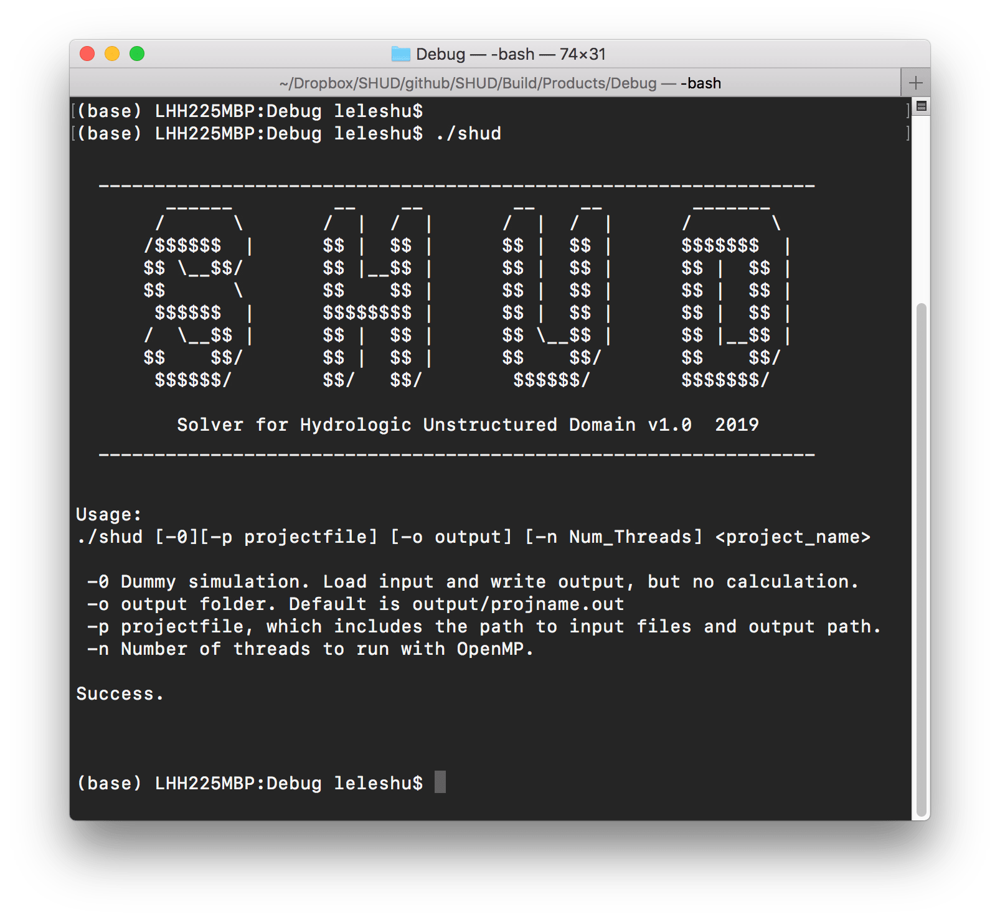
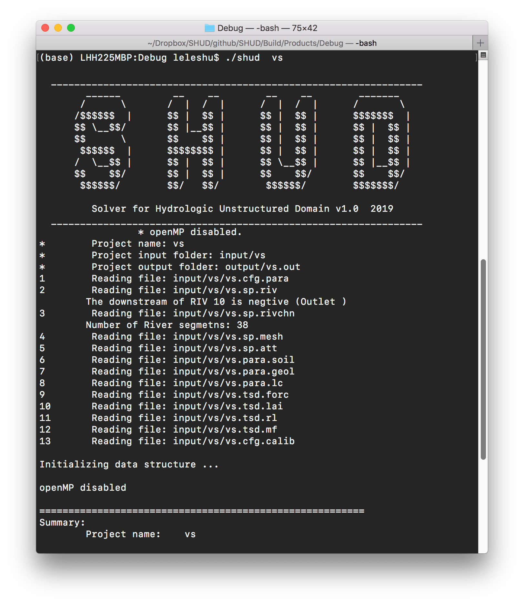

# Install SHUD and SHUDtoolbox

## SUNDIALS/CVODE
The SHUD model requires the support of the SUNDIALS or CVODE library. 
[**SUNDIALS**](https://computation.llnl.gov/projects/sundials) is a SUite of Nonlinear and Differential/ALgebraic equation Solvers, consists of six solvers.  [**CVODE**](https://computation.llnl.gov/projects/sundials/cvode) is a solver for stiff and nonstiff ordinary differential equation (ODE) systems (initial value problem) given in explicit form $y' = f(t,y)$. The methods used in CVODE are variable-order, variable-step multistep methods. You can install the entire SUNDIALS suite or CVODE only. 

Since the SUNDIALS/CVODE keeps updating periodically and significantly, the function names and structure are changed accordingly, we suggest to use the specific version of the solver, rather than the latest solver.


SUNDIALS/CVODE is available in [LLNL: https://computation.llnl.gov/projects/sundials/sundials-software](https://computation.llnl.gov/projects/sundials/sundials-software)

The installation of CVODE v3.x:


1. Go to your Command-Line and enter your workspace and unzip your CVODE source code here.
1. make directories for CVODE, including *builddir*.
```
mkdir builddir
cd builddir/
```
1. Try ccmake. Install ``cmake`` if you don't have one.
```
ccmake 
```

1.  Run ccmake to configure your compile environment.
```
ccmake ../sundials/cvode-5.0.0
```

This is an empty configure. Press `c` to start the configuration.


The default configuration. Make sure the value for three lines:
```
BUILD_CVODE = ON
CMAKE_INSTALL_PREFIX = ~/sundials
EXAMPLES_INSTALL_PATH = ~/sundials/examples
```
After the modification of values, press `c` to confirm configuration.


The ccmake configures the environment automatically. When the configuration is ready, press `g` to generate and exit.

1. Then you run commands below:
```
make
make install 
```

## SHUD

Configuration in *Makefile*:

1. Path of *SUNDIALS_DIR.* [**CRITICAL**]. If you install SUNDIALS into *~/sundials*, you don't change this line..
1. Path of OpenMP if the parallel is preferred.
1. Path of SRC_DIR, default is `SRC_DIR = .`
1. Path of BUILT_DIR, default is `BUILT_DIR = .` 

After updating the SUNDIALS path in the *Makefile*, user can compile the SHUD with:
```
make clean
make shud
```

There are more options to compile the SHUD code:

- `make all`        - clean, then make both shud and shud_omp
- `make help`       - help information
- `make shud`       - make SHUD executable
- `make shud_omp`   - make shud_omp with OpenMP support


### OpenMP
If parallel-computing is prefered, please install OpenMP.     For mac: 
```
brew install llvm clang
brew install libomp
compile flags for OpenMP: 
  -Xpreprocessor -fopenmp -lomp
Library/Include paths:
  -L/usr/local/opt/libomp/lib 
  -I/usr/local/opt/libomp/include
```
### Run SHUD executables.
After the successful installation and compile, you can run SHUD models using
```
./shud <projectname>
```


Command line pattern is:
```
./shud [-0][-p projectfile] [-o output] [-n Num_Threads] <project_name>
```
- `-0` Dummy simulation. Load input and write output, but no calculation.

- `<project name>` is the name of the project.

- `[-p projectfile]` Specify the project file, which includes the path to input files and output path.

- `[-o output_folder]` Output directory. Default is output/projname.out

- `[-n Num_Threads]` Number of threads to run with OpenMP, which works with `shud_omp` only.
  Usage:

  

When the `shud` program starts to run, the screen should look like this:


## SHUDtoolbox
This SHUDtoolbox is an R package. What you need is to install the package as a source code package.
For example:

```
install_github('SHUD-System/SHUDtoolbox')
```

The prerequisite packages for SHUDtoolbox are:

- Rcpp
- reshape2
- ggplot2
- gridExtra
- grid
- fields
- xts 
- hydroGOF
- zoo
- raster (>= 2.1.0) 
- sp 
- rgeos 
- RTriangle
- rgdal (>= 1.1.0)
- proj4
- abind
- utils
- lubridate
- geometry
- methods
- ncdf4
- GGally
- doParallel

One of the required packages, RTriangle, must be installed via GitHub instead of CRAN, using command:
```
install_github('shulele/RTriangle/pkg') 
```

