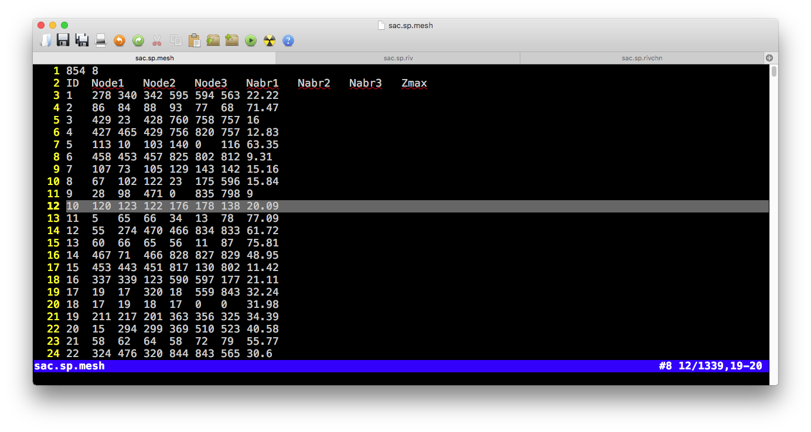
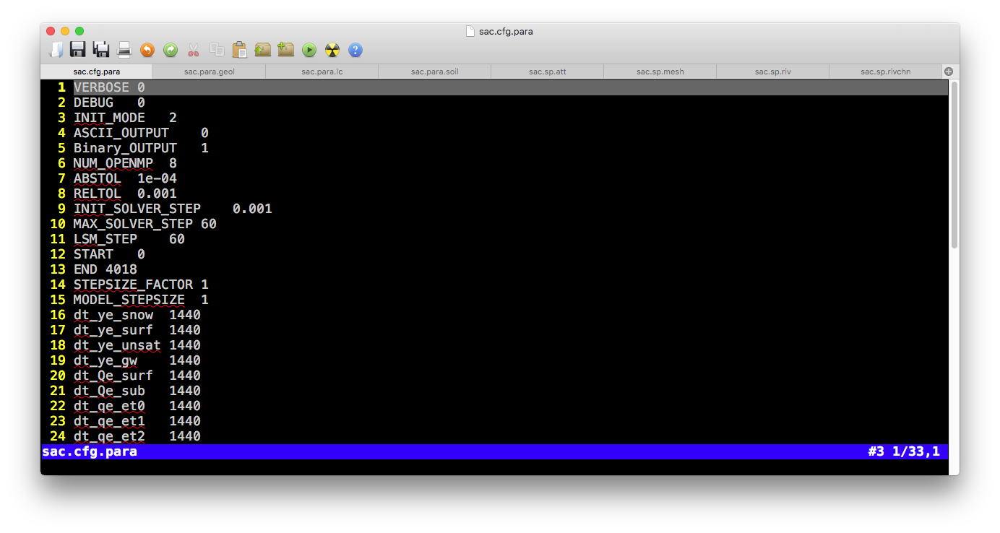
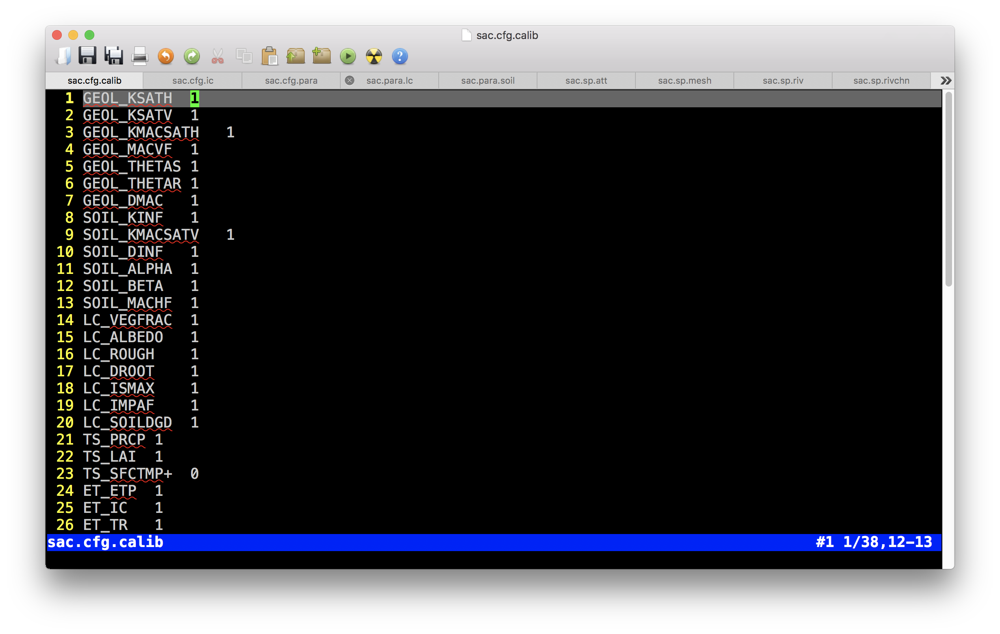
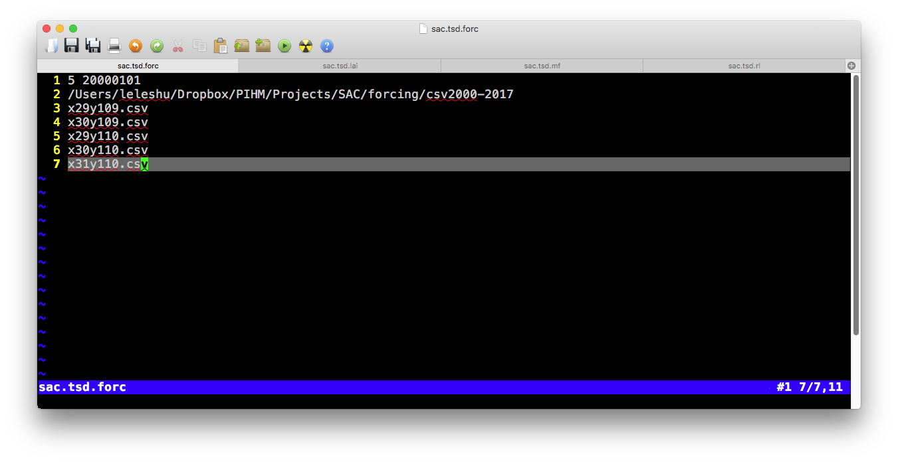
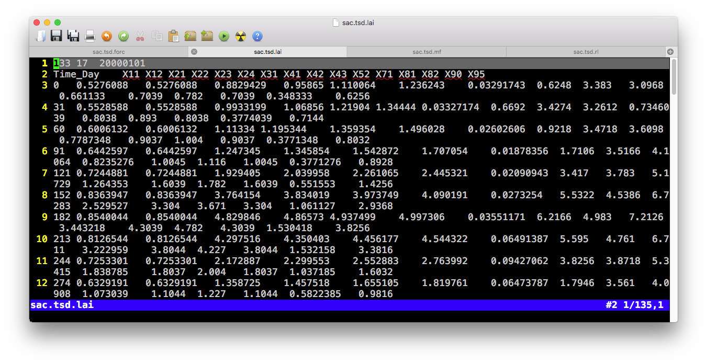
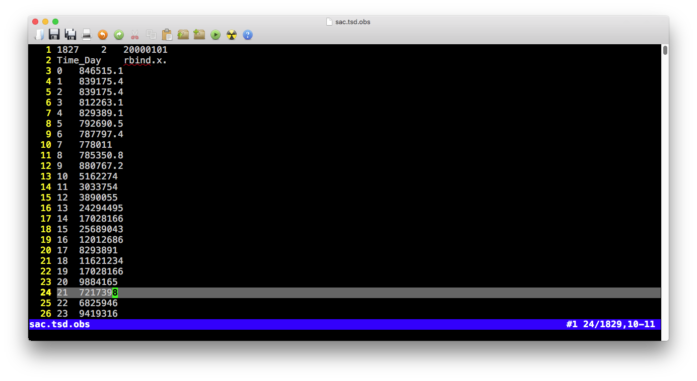

# Input files

List of input files:

| File | Category | Comments | Header | # of column |
 |:------:|:------------------:|:------:|:------:|:---------------------:|
| .mesh | sp | Domain **element** (triangular mesh)  | Yes | |
| .att | sp | Attribute table of triangular **elements**  | Yes | |
| .riv | sp | **Rivers**  | Yes | |
| .rivchn | sp | Topologic relation b/w **River** and **Element**  | Yes | |
| .calib | cfg | Calibration on physical parameters  | Yes | |
| .para | cfg |  Parameters of the model configurature  | Yes | |
| .ic | cfg | Intial conditions  | Yes | |
| .geol | para | Physical parameters for **Geology** layers  | Yes | |
| .soil | para | Physical parameters for **Soil** layers  | Yes | |
| .lc | para | Physical parameters for **Land cover** layers  | Yes | |
| .forc | tsd | List of files to the Time-series forcing data | Yes | |
| .csv | tsd | Time-series **forcing** data  | Yes | |
| .lai | tsd | Time-series **LAI** data  | Yes | |
| .obs | tsd | Time-series observational data for calibration purpose only  | Yes | |
| .mf | tsd | Time-series **Melt Factor** data  | Yes | |
| .rl | tsd | Time-series **Roughness Length** data  | Yes | |
| gis/domain | Shapefile | Shapefile of .mesh file | x | x |
| gis/river | Shapefile | Shapefile of .riv file | x | x |
| gis/seg | Shapefile | Shapefile of .rivchn file   | x | x |

The files in folder *gis* and *fig* are not involved in SHUD modeling, but they are very useful for your data pre- and post-processing. 

## Spatial data

### .sp.mesh file

There are two tables in the .mesh file, the one is a table of elements and the other is a table of nodes of elements.

* **Block 1 (Element information)**

- Pre-table

| Value1 | Value2 | 
|:---------:|:---------:|
| Number of rows ( $N_{element}$) | Number of columns ($8$) |

- Table
  
| Colname | Meaning | Range | Unit | Comments |
 |:------:|:------------------:|:------:|:------:|:---------------------:|
| ID | Index of element $i$  |  1 ~ $N_{element}$ | - | |
| Node1 | Node 1 of element $i$ |  1 ~ $N_{node}$ | - | |
| Node2 | Node 2 of element $i$ |  1 ~ $N_{node}$ | - | |
| Node3 | Node 3 of element $i$ |  1 ~ $N_{node}$ | - | |
| Nabr1 | Index of Neighbor 1 of element $i$ |  1 ~ $N_{element}$ | - | |
| Nabr2 | Index of Neighbor 2 of element $i$ |  1 ~ $N_{element}$ | - | |
| Nabr3 | Index of Neighbor 3 of element $i$ |  1 ~ $N_{element}$ | - | |
| Zmax | Surface elevation of  element $i$| -9999 ~ +inf | $m$ | |

* **Block 2 (node information)**

- Pre-table:

| Value1 | Value2 | 
|:---------:|:---------:|
| Number of rows ( $N_{node}$) | Number of columns ($5$) |

- Table
  
| Colname | Meaning | Range | Unit | Comments |
 |:------:|:------------------:|:------:|:------:|:---------------------:|
| ID | Index of node $i$  |  1 ~ $N_{element}$ | - | |
| X | X coordinate of node $i$ |  1 ~ $N_{node}$ | - | |
| Y | Y coordinate of node $i$ |  1 ~ $N_{node}$ | - | |
| AqDepth | Thickness of aquifer $i$| 0 ~ +inf | $m$ | |
| Elevation | Surface elevation of  node $i$| -9999 ~ +inf | $m$ | |

### .sp.att file

- Pre-table

| Value1 | Value2 | 
|:---------:|:---------:|
| Number of rows ( $N_{element}$) | Number of columns ($7$) |

- Table
  
| Colname | Meaning | Range | Unit | Comments |
 |:------:|:------------------:|:------:|:------:|:---------------------:|
| ID | Index of element $i$  |  1 ~ $N_{element}$ | - | |
| SOIL | Index of soil type  |  1 ~ $N_{soil}$ | - | |
| GEOL | Index of geology type  |  1 ~ $N_{geol}$ | - | |
| LC | Index of land cover type  |  1 ~ $N_{lc}$ | - | $N_{lc}$ = $N_{lai}$ |
| FORC | Index of forcing site  |  1 ~ $N_{forc}$ | - | |
| MF | Index of melt factor  |  1 ~ $N_{mf}$ | - | |
| BC | Index of boundary condition  |  1 ~ $N_{bc}$ | - | |

### .sp.riv file

- Pre-table

| Value1 | Value2 | 
|:---------:|:---------:|
| Number of rows ( $N_{riv}$) | Number of columns ($5$) |

- Table
  
| Colname | Meaning | Range | Unit | Comments |
 |:------:|:------------------:|:------:|:------:|:---------------------:|
| ID | Index of river $i$  |  1 ~ $N_{river}$ | - | |
| DOWN | Index of downstream river  |  1 ~ $N_{river}$ | - | Negative vlaue indicates outlet|
| Type | Index of river parameters |  1 ~ $N_{rivertype}$ | - | |
| Slope | Slope of river bed  |  -10 ~ 10 | $m/m$ | Height/Length |
| Length | Length of the river $i$  |  0 ~ inf | $m$ | |

### .sp.rivseg file

- Pre-table

| Value1 | Value2 | 
|:---------:|:---------:|
| Number of rows ( $N_{segment}$) | Number of columns ($4$) |

- Table
  
| Colname | Meaning | Range | Unit | Comments |
 |:------:|:------------------:|:------:|:------:|:---------------------:|
| ID | Index of segments $i$  |  1 ~ $N_{segment}$ | - | |
| iRiv | Index of river |  1 ~ $N_{river}$ | - | |
| iEle | Index of element |  1 ~ $N_{element}$ | - | |
| Length | Length of the segments $i$  |  0 ~ inf | $m$ | |

## Model configuration files

### .cfg.para file

- Table
  
| Colname | Meaning | Range | Unit | Comments |
 |:-------------:|:------------------:|:------:|:------:|:---------------------:|
| VERBOSE| Verbose mode | - | - | |  
| DEBUG| Debug mode | - | - | |  
| INIT_MODE| Initial condition mode | 1,2,3| - | 1=Dry condition, 2=Relief conditon, 3=Warm start|  
| ASCII_OUTPUT| ASCII ouput | 1/0 | - | |  
| Binary_OUTPUT| Binary output | 1/0 | - | |  
| NUM_OPENMP| Number of threads for OpenMP | 0 ~ $N_{threads}$ | - | |  
| ABSTOL| Abosolute tolerance for CVODE solver | 1e-6 ~ 0.1 | - | |  
| RELTOL| Relative tolerance for CVODE solver | 1e-6 ~ 0.1 | - | |  
| INIT_SOLVER_STEP| Initial time step for CVODE solver | ? | - | |  
| MAX_SOLVER_STEP| Maximum time step for CVODE solver | ? | - | |  
| ET_STEP| Time step of Evapotranspiration | 1~360 | $min$ | |  
| START| Start Time | 0 ~ inf | $day$ | |  
| END| End Time | - | $day$ | |  
| dt_ye_snow | Time step of output snow storage | 0 ~ inf | $min$ | |  
| dt_ye_surf | Time step of output surface storage | 0 ~ inf | $min$ | |  
| dt_ye_unsat | Time step of output unsaturated storage | 0 ~ inf | $min$ | |  
| dt_ye_gw | Time step of output groundwater head | 0 ~ inf | $min$ | |  
| dt_Qe_surf | Time step of output surface element flux | 0 ~ inf | $min$ | |  
| dt_Qe_sub | Time step of output subsurface element flux  | 0 ~ inf | $min$ | |  
| dt_qe_et0 | Time step of output element flux, interception | 0 ~ inf | $min$ | |  
| dt_qe_et1 | Time step of output element flux, transpiration | 0 ~ inf | $min$ | |  
| dt_qe_et2 | Time step of output element flux, evaporation | 0 ~ inf | $min$ | |  
| dt_qe_etp | Time step of output element flux, potential ET | 0 ~ inf | $min$ | |  
| dt_qe_prcp | Time step of output element flux, interception | 0 ~ inf | $min$ | |  
| dt_qe_infil | Time step of output element flux, interception | 0 ~ inf | $min$ | |  
| dt_qe_rech | Time step of output element flux, interception | 0 ~ inf | $min$ | |  
| dt_yr_stage | Time step of output river stage | 0 ~ inf | $min$ | |  
| dt_Qr_down | Time step of output river flux, downstream | 0 ~ inf | $min$ | |  
| dt_Qr_surf | Time step of output river flux, surface flow | 0 ~ inf | $min$ | |  
| dt_Qr_sub | Time step of output river flux, base flow | 0 ~ inf | $min$ | |  
| dt_Qr_up | Time step of output river flux, upstream | 0 ~ inf | $min$ | |  

### .cfg.calib file

- Table
  
| Colname | Meaning | Range | Unit | Comments |
 |:------:|:------------------:|:------:|:------:|:---------------------:|
| GEOL_KSATH | Horizontal conductivity of ground water | ? | - | |  
| GEOL_KSATV | Vertical conductivity of ground water  | ? | - | | 
| GEOL_KMACSATH | Horizontal conductivity of macropore | ? | - | |  
| GEOL_DMAC | Macropore depth |  | - | |  
| GEOL_THETAS | Porosity, saturated soil moisture |  | - | |  
| GEOL_THETAR | Residual soil moisture |  | - | |  
| GEOL_MACVF | Vertical macropore areal fraction |  | - | |  
| SOIL_KINF | Vertical conductivity of top soil | ? | - | |  
| SOIL_KMACSATV | Vertical conductivity of soil macropore | ? | - | | 
| SOIL_DINF | Infiltration depth | ? | - | |  
| SOIL_DROOT | Root depth |  | - | |  
| SOIL_ALPHA | $\alpha$ value in van Genuchten equation |  | - | |  
| SOIL_BETA | $\beta$ value in van Genuchten equation |  | - | |  
| SOIL_MACHF | Horizontal macropore areal fraction |  | - | |  
| LC_VEGFRAC | Vegetation fraction |  | - | |  
| LC_ALBEDO | Emissitive reflection ratio |  | - | |  
| LC_ROUGH | Manning's roughness of element surface |  | - | |  
| LC_SOILDGD | Soil degradation |  | - | |  
| LC_IMPAF | Impervious areal fraction |  | - | |  
| LC_ISMAX | Maximum interception |  | - | |  
| AQ_DEPTH+ | Thichness of aquifer |  | $m$ | |  
| TS_PRCP | Precipitation |  | - | |  
| TS_SFCTMP+ | Temperature |  | $C$ | |  
| ET_ETP | Transpiration |  | - | |  
| ET_IC | Interception |  | - | |  
| ET_TR | Evaporation |  | - | |   
| ET_SOIL | Evaporation |  | - | |  
| RIV_ROUGH | Manning's roughness of river |  | - | |  
| RIV_KH | Conductivity of river bed |  | - | |  
| RIV_DPTH+ | Depth of river cross section |  | $m$ | |  
| RIV_WDTH+ | Width of river cross section |  | $m$ | |  
| RIV_SINU | Sinuosity of river path |  | - | |  
| RIV_CWR | $C_{wr}$ in Chezy equation |  | - | |  
| RIV_BSLOPE+ | Slope of river bed |  | $m/m$ | |  
| IC_GW+ | Initial condition of groundwater |  | $m$ | |  
| IC_RIV+ | Initial condition of river stage |  | $m$ | |  

### .cfg.ic file

* **Block 1 (Element initial condition)**

- Pre-table

| Value1 | Value2 | 
|:---------:|:---------:|
| Number of rows ( $N_{element}$) | Number of columns ($6$) |

- Table
  
| Colname | Meaning | Range | Unit | Comments |
 |:------:|:------------------:|:------:|:------:|:---------------------:|
| ID | Index of element $i$  |  1 ~ $N_{element}$ | - | |
| Canopy | Canopy storage of element $i$  |  0 ~ inf | $m$ | |
| Snow | Snow storage of element $i$  |  0 ~ inf | $m$ | |
| Surface | Surface storage of element $i$  |  0 ~ inf | $m$ | |
| Unsat | Unsaturated storage of element $i$  |  0 ~ inf | $m$ | |
| GW | Groundwater head of element $i$  |  0 ~ inf | $m$ | |

* **Block 2 (river initial condition)**

- Pre-table:

| Value1 | Value2 | 
|:---------:|:---------:|
| Number of rows ( $N_{riv}$) | Number of columns ($2$) |

- Table
  
| Colname | Meaning | Range | Unit | Comments |
 |:------:|:------------------:|:------:|:------:|:---------------------:|
| ID | Index of river $i$  |  1 ~ $N_{riv}$ | - | |
| Stage | Stage of river $i$  |  0 ~ inf | $m$ | |

## Time-series data

### .tsd.forc file

- Line 1: `Number of forcing sites | Start day (YYYYMMDD)`
- Line 2: Directory to the spreadsheet
- Line 3~N: Filenames of spreadsheet

- Pre-table:

| Value1 | Value2 | 
|:---------:|:---------:|
| ( $0$) | Number of columns ($6$) |

- Table
  
| Colname | Meaning | Range | Unit | Comments |
 |:------:|:------------------:|:------:|:------:|:---------------------:|
| Day | Time |  0 ~ $N_{day}$ | $day$ | |
| PRCP | Precipitation  |  0 ~ 1 | $m/day$ | |
| TEMP | Temperature  |  -100 ~ 70 | $C$ | |
| RH | Relative Humidity |  0 ~ 1 | $-$ | |
| wind | Wind Speed |  0 ~ inf | $m/day$ | |
| Rn | Solar (shortwave) radiation |  ? | $J/day/m^2$ | |

### .tsd.lai file

- Pre-table:

| Value1 | Value2 | Value3 | 
|:---------:|:---------:|:---------:|
| Number of day ( $N_{time}$) | Number of columns ($N_{lc}$) | Start day (YYYYMMDD) |

- Table
  
| Colname | Meaning | Range | Unit | Comments |
 |:------:|:------------------:|:------:|:------:|:---------------------:|
| TIME | Time |  0 ~ $N_{time}$ | $day$ | |
| Column 2 | LAI of land cover 1  |  0 ~ inf | $m^2/m^2$ | |
| Column i | LAI of land cover $i-1$  |  0 ~ inf | $m^2/m^2$ | |
| ... | ...  |  ... | ... | |

### .tsd.rl file

- Pre-table:

| Value1 | Value2 | Value3 | 
|:---------:|:---------:|:---------:|
| Number of day ( $N_{time}$) | Number of columns ($N_{lc}$) | Start day (YYYYMMDD) |

- Table
  
| Colname | Meaning | Range | Unit | Comments |
 |:------:|:------------------:|:------:|:------:|:---------------------:|
| TIME | Time |  0 ~ $N_{time}$ | $day$ | |
| Column 2 | Roughness length of land cover 1  |  0 ~ inf | $m$ | |
| Column i | Roughness length of land cover $i-1$  |  0 ~ inf | $m$ | |
| ... | ...  |  ... | ... | |

### .tsd.mf file

- Pre-table:

| Value1 | Value2 | Value3 | 
|:---------:|:---------:|:---------:|
| Number of day ( $N_{time}$) | Number of columns ($N_{mf}$) | Start day (YYYYMMDD) |

- Table
  
| Colname | Meaning | Range | Unit | Comments |
 |:------:|:------------------:|:------:|:------:|:---------------------:|
| TIME | Time |  0 ~ $N_{time}$ | $day$ | |
| Column 2 | Melt factor 1  |  0 ~ inf | - | |
| Column i | Melt factor $i-1$  |  0 ~ inf | - | |
| ... | ...  |  ... | ... | |

### .tsd.obs file

- Pre-table:

| Value1 | Value2 | Value3 | 
|:---------:|:---------:|:---------:|
| Number of day ( $N_{time}$) | Number of columns ($N_{obs}$) | Start day (YYYYMMDD) |

- Table
  
| Colname | Meaning | Range | Unit | Comments |
|:------:|:------------------:|:------:|:------:|:---------------------:|
| TIME | Time |  0 ~ $N_{time}$ | $day$ | |
| Column 2 | Observational data 1  |  ? | ? | |
| Column i | Observational data $i-1$  |  ? | ? | |
| ... | ...  |  ... | ... | |

