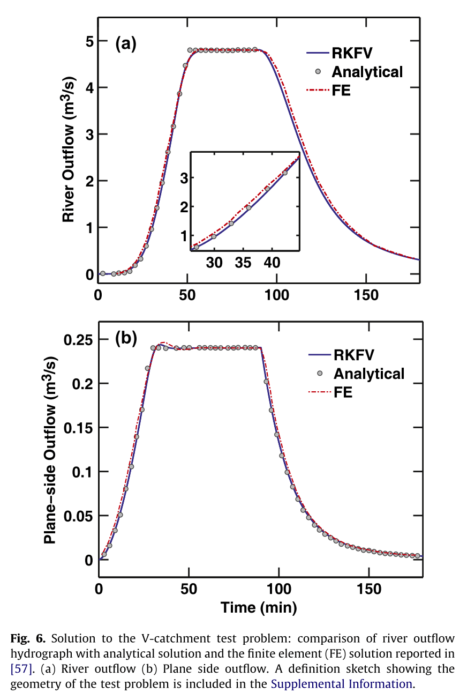
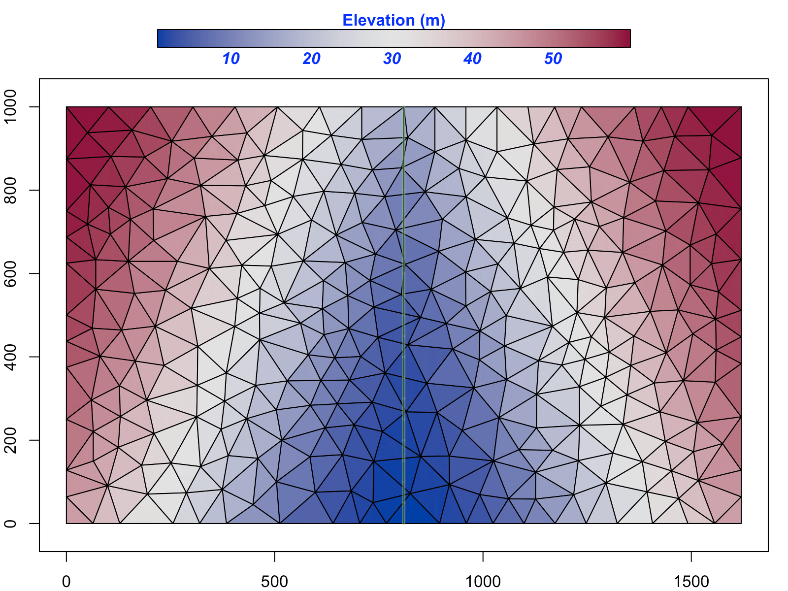

## Example 1: V-Catchment
Code annd data are available at  or [Github: https://github.com/Model-Intercomparison-Datasets/V-Catchment](https://github.com/Model-Intercomparison-Datasets/V-Catchment)

The V-Catchment (VC) experiment is a standard test case for numerical hydrological models to validate their performance for overland flow along a hillslope and in the presence of a river channel.
The VC domain consists of two inclined planes draining into a sloping channel. 

Both hillslopes are $800 \times 1000 m$ with Manning's roughness $n=0.015$.  The river channel between the hillslopes is $20$ m wide and $1000$ m in length with $n=0.15$. The slope from the ridge to the river channel is 0.05 (in the $x$ direction), and the longitudinal slope (in the $y$ direction) is 0.02.

Rainfall in the VC begins at time zero at a constant rate of $18 mm/hr$ and stops after 90 min, producing $27$ mm of accumulated precipitation. Since evaporation and infiltration is not involved in this simulation, the total outflow from lateral boundaries and the river outlet must be the same as the total precipitation (following conservation of mass).  

### Shen(2010) result

I use SHUD model to repeat the VC experiment, there are several literatures did the same experiment, but only Shen(2010) export the flux on side-plane which is also useful to validate the modeling algorithm. 

However, the value of volume flux of side-plane in Shen(2010) is problematic. Lets explain: based on the Continuity Law, the total input (precipitation) must be equal to output (side-plane flow) or discharge (outlet flow). But the side-plane flux in Shen (2010) is 20 times less than the discharge. I assume Shen made a wrong unit conversion somehow. When I enlarge the side-plane flux by 20, the flux rate and accumulated flux are rational. I tried to contact Shen, but he didn't reply with explanation, so I continue the work with my understanding.

The result figure below also supports my thought. The side-plane flux in the result figure is the modified value (Shen's side-plane flux times 20). Both flow rate meet the Continuity Law. So, I think this is the right interpretation of Shen's result.

