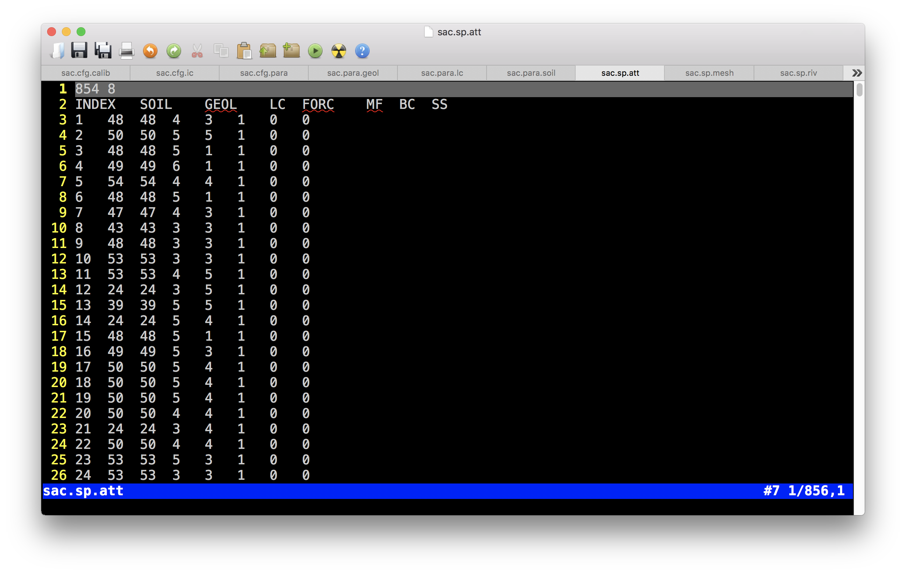
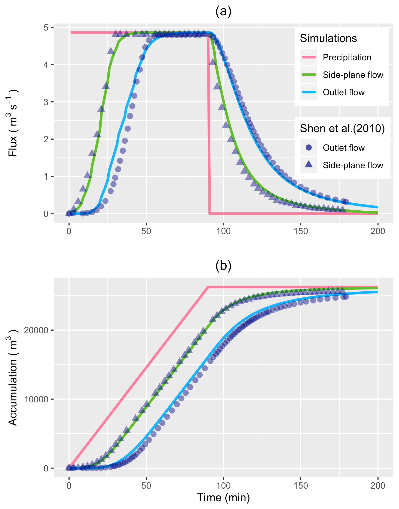
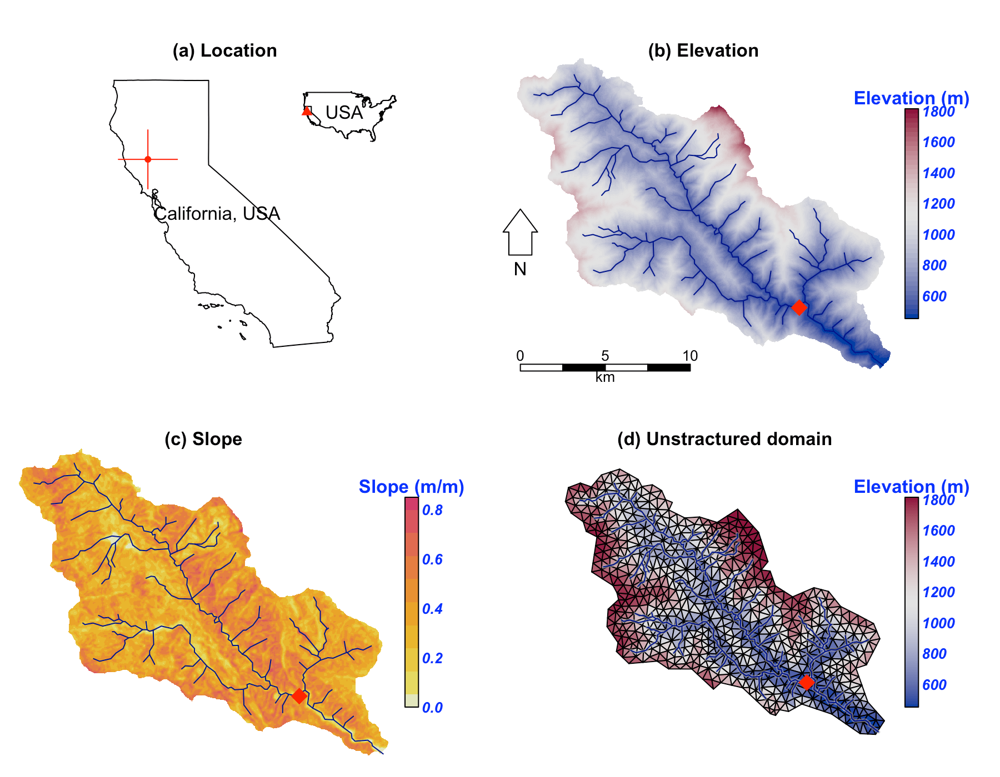
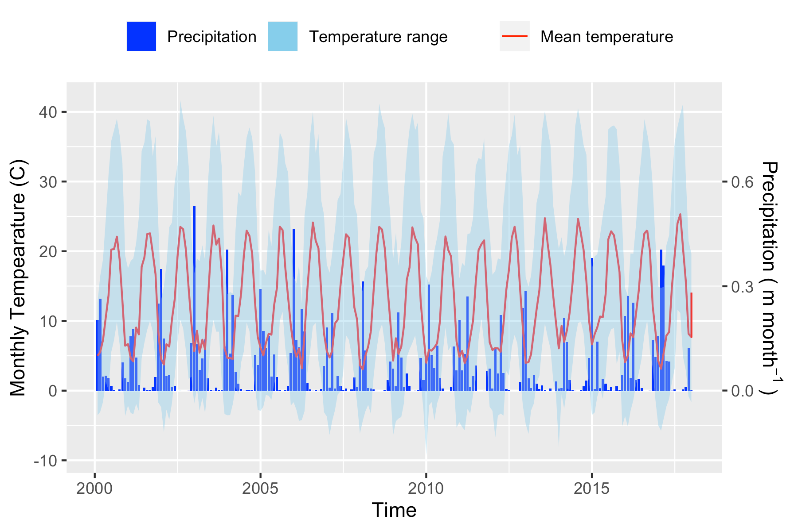
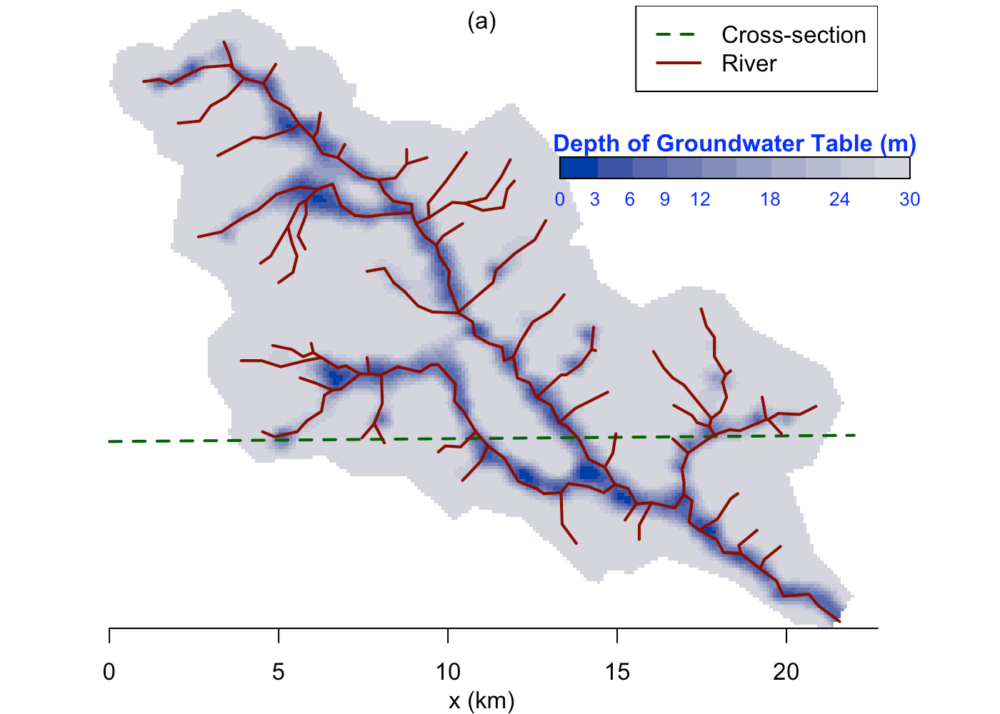
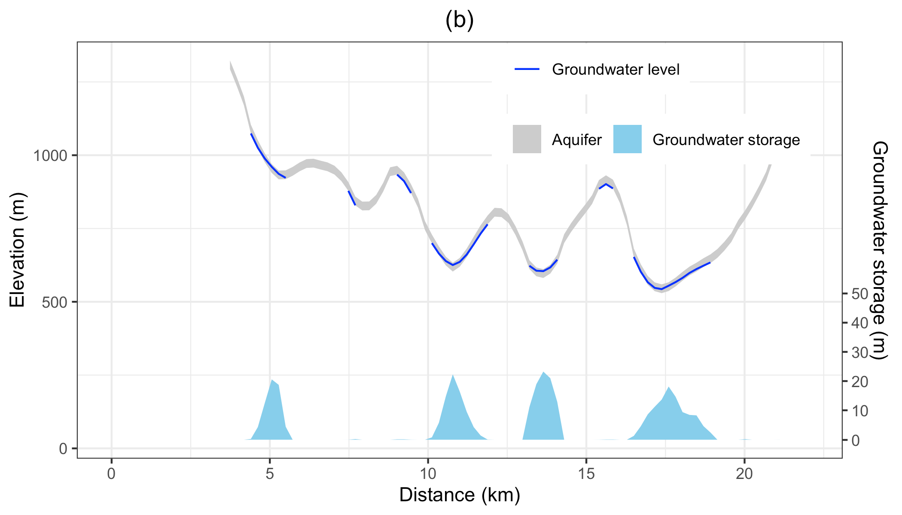
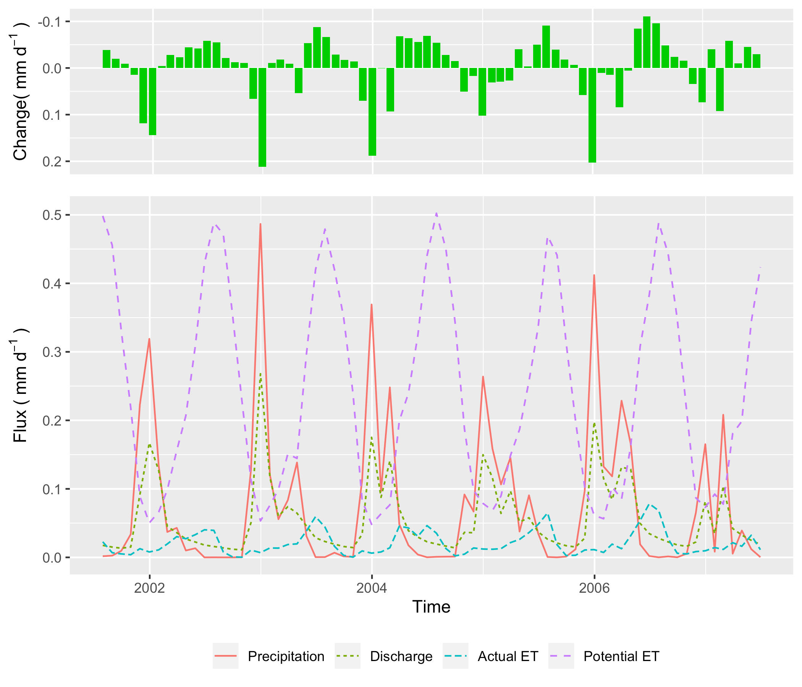
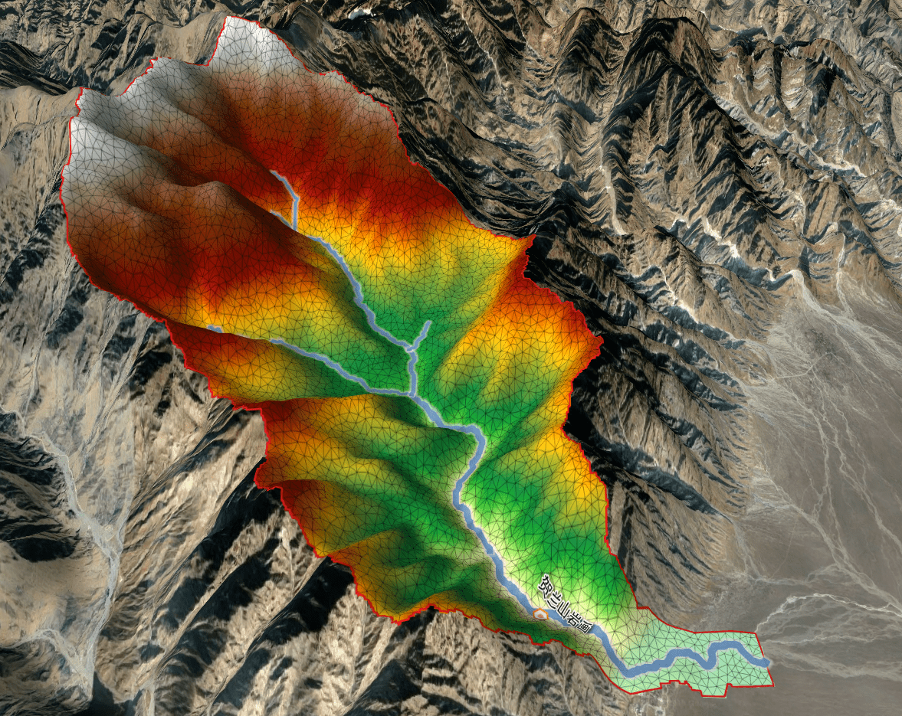
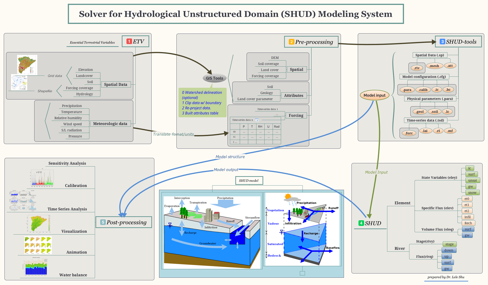

--- 
title: "Solver for Hydrologic Unstructured Domain (SHUD)"
subtitle: 'User Guide'
author: "Lele Shu (lele.shu@gmail.com)"
date: "`r Sys.Date()`"
documentclass: scrbook
output:
  bookdown::pdf_book:
    template: null
    toc: true
    toc_depth: 3
    includes:
      in_header: preamble.tex
description: SHUD User Guide
link-citations: yes
bibliography: book.bib
site: bookdown::bookdown_site
biblio-style: apalike
---
# Overview {#Overview}

<!--chapter:end:index.Rmd-->


This file is a user guide or technical documentation of the SHUD modeling system.
PDF version of the User Guide is available via :[SHUD User Guide](https://www.shud.xyz/_book/SHUD_User_Guide.pdf)

The Solver for Hydrologic Unstructured Domain  (SHUD - pronounced  “SHOULD”) is a multi-process, multi-scale hydrological model where major  hydrological processes are fully coupled using the semi-discrete **Finite Volume Method** (FVM).

**SHUDtoolbox** is an open-source GIS and hydrological analysis toolbox designed for the SHUD modeling system.  The SHUDtoolbox provides access to the digital data sets (terrain, forcing, and parameters) and tools necessary to drive the model, as well as a collection of GIS-based pre- and post-processing tools.

Collectively the system is referred to as the **SHUD Modeling System**. 

The SHUD and SHUDtoolbox is an open-source software, freely available for download at [SHUD website](https://SHUD-system.github.io) or [Github Page](https://github.com/SHUD-System/) along with installation and user guides.

## Standing on the shoulders of giants

As a descendant of PIHM, SHUD inherits the fundamental idea of solving hydrological variables in CVODE. The code has been completely rewritten in a new programming language, with a new discretization and corresponding improvements to the underlying algorithms, adapting new mathematical schemes and a new user-friendly input/output data format. Although SHUD is forked from PIHM’s track, SHUD still inherits the use of CVODE for solving the ODEs but modernizes and extends PIHM’s technical and scientific capabilities. The SHUD is imcompatible to PIHM. 

It is our intention (me and previous PIHM group)to begin a debate on the role of *Community Models* in the hydrologic sciences. 

SHUD and PIHM represent our strategy for the synthesis of *multi-state*, *multi-scale* distributed hydrologic models using the integral representation of the underlying physical process equations and state variables. 

Our interest is in devising a concise representation of watershed and/or river basin hydrodynamics, which allows interactions among major physical processes operating simultaneously, but with the flexibility to add or eliminate states/processes/constitutive relations depending on the objective of the numerical experiment or purpose of the scientific or operational application.

To satisfy the objectives, the SHUD...

- is a distributed hydrologic model, based on the semi-discrete **Finite Volume Method (FVM)** in which domain discretization is an unstructured triangular irregular network (e.g. Delaunay triangles) generated with constraints (geometric, and parametric). A local prismatic control volume is formed by the vertical projection of the Delaunay triangles forming each layer of the model. Given a set of constraints (e.g. river network support, watershed boundary, altitude zones, ecological regions, hydraulic properties, climate zones, etc), an “optimal” mesh is generated. River volume cells are also prismatic, with trapezoidal or rectangular cross-section, and are generated along or cross edges of Delaunay triangles. The local control volume contains all equations to be solved and is referred to as the model kernel. 
- is a physically-based model in which all equations used are describing the physics of the hydrological processes which control the catchment. The physical model is able to predict the water in the ungage water system, to estimate the sediment, pollutants, and vegetation, etc., such that it is practical to be coupled with biochemistry, geomorphology, limnology, and other water-related research. 
The global ODE system is assembled by combining all local ODE systems throughout the domain and then solved by a state-of-the-art parallel ODE solver known as CVODE developed at the Lawrence Livermore National Laboratory.
- is a fully-coupled hydrologic model, where the state and flux variables in the hydrologic system are solved within the same time step and conserve the mass. The fluxes are infiltration, overland flow, groundwater recharge, lateral groundwater flow, exchange of river and soil/groundwater and river discharge.
-  is of an adaptable temporal and spatial resolution. The spatial resolution of the model varies from meters to kilometers based requirement of modeling and computing resources. The internal time step of the iteration step is adjustable; it is able to export the status of the catchment in less  1 second to days. Also, the time interval for exporting results is configured flexibly. The flexible spatial and temporal resolution is rather valuable for community model coupling.
- is an open-source model; anyone can access the source code, use and submit their improvement.
- is a long-term yield and single-event flood model.


## Brief History of PIHM system
- 2005 PIHM v1.0

Dr. Yizhong Qu [@Qu2007] developed and verified the first version of PIHM in 2001-2005 during his Ph.D. in Pennsylvania State Unversity, following the blueprint of Freeze and Harlan (1969). This version of PIHM is the soul of the PIHM model.

- 2009 PIHMgis 

Dr. Gopal Bhartt [@Bhatt2012] developed the PIHMgis with support of C++, Qt GUI library, TRIANGLE library, and QGIS developing kit. The development of PIHMgis makes the learning curve of PIHM moderate and benefits the developing, modeling and coupling.

- 2015 MM-PIHM

Dr. Yuninh Shi led and developed the MM-PIHM (Multi-Module PIHM), which embedded all modules from PIHM family, such as RT-PIHM, LE-PIHM, flux-PIHM, BGC-PIHM, etc. together. The sophisticated design and coupling of the MM-PIHM is the summit of the PIHM as a *Community Model* that combined all water-related modules together.

- 2019 SHUD

  Based on the accumulated contribution of PIHM modeling and coupling with related researches, it is necessary to solve the known bugs and limitations,
  improve the performance of the model with parallel methods, and adopt new updates from SUNDIALS solver and programming strategy. 

Several publications that may helps:

- [@Qu2004]
- [@Qu2007]
- [@Li2008]
- [@Kumar2004a]
- [@Kumar2009d]
- [@Yu2015]
- [@Yu2014]
- [@Li2011]
- [@Shi2015]
- [@Shi2015a]
- [@Bhatt2014]


<!--chapter:end:01-overview.Rmd-->

# Install SHUD and SHUDtoolbox

## SUNDIALS/CVODE
The SHUD model requires the support of the SUNDIALS or CVODE library. 
[**SUNDIALS**](https://computation.llnl.gov/projects/sundials) is a SUite of Nonlinear and Differential/ALgebraic equation Solvers, consists of six solvers.  [**CVODE**](https://computation.llnl.gov/projects/sundials/cvode) is a solver for stiff and nonstiff ordinary differential equation (ODE) systems (initial value problem) given in explicit form $y' = f(t,y)$. The methods used in CVODE are variable-order, variable-step multistep methods. You can install the entire SUNDIALS suite or CVODE only. 

Since the SUNDIALS/CVODE keeps updating periodically and significantly, the function names and structure are changed accordingly, we suggest to use the specific version of the solver, rather than the latest solver.


SUNDIALS/CVODE is available in [LLNL: https://computation.llnl.gov/projects/sundials/sundials-software](https://computation.llnl.gov/projects/sundials/sundials-software)

The installation of CVODE v3.x:


1. Go to your Command-Line and enter your workspace and unzip your CVODE source code here.
1. make directories for CVODE, including *builddir*.
```
mkdir builddir
cd builddir/
```
1. Try ccmake. Install ``cmake`` if you don't have one.
```
ccmake 
```

1.  Run ccmake to configure your compile environment.
```
ccmake ../sundials/cvode-5.0.0
```

This is an empty configure. Press `c` to start the configuration.


The default configuration. Make sure the value for three lines:
```
BUILD_CVODE = ON
CMAKE_INSTALL_PREFIX = ~/sundials
EXAMPLES_INSTALL_PATH = ~/sundials/examples
```
After the modification of values, press `c` to confirm configuration.


The ccmake configures the environment automatically. When the configuration is ready, press `g` to generate and exit.

1. Then you run commands below:
```
make
make install 
```

## SHUD

Configuration in *Makefile*:

1. Path of *SUNDIALS_DIR.* [**CRITICAL**]. If you install SUNDIALS into *~/sundials*, you don't change this line..
1. Path of OpenMP if the parallel is preferred.
1. Path of SRC_DIR, default is `SRC_DIR = .`
1. Path of BUILT_DIR, default is `BUILT_DIR = .` 

After updating the SUNDIALS path in the *Makefile*, user can compile the SHUD with:
```
make clean
make shud
```

There are more options to compile the SHUD code:

- `make all`        - clean, then make both shud and shud_omp
- `make help`       - help information
- `make shud`       - make SHUD executable
- `make shud_omp`   - make shud_omp with OpenMP support


### OpenMP
If parallel-computing is prefered, please install OpenMP.     For mac: 
```
brew install llvm clang
brew install libomp
compile flags for OpenMP: 
  -Xpreprocessor -fopenmp -lomp
Library/Include paths:
  -L/usr/local/opt/libomp/lib 
  -I/usr/local/opt/libomp/include
```
### Run SHUD executables.
After the successful installation and compile, you can run SHUD models using
```
./shud <projectname>
```


Command line pattern is:
```
./shud [-0][-p projectfile] [-o output] [-n Num_Threads] <project_name>
```
- `-0` Dummy simulation. Load input and write output, but no calculation.

- `<project name>` is the name of the project.

- `[-p projectfile]` Specify the project file, which includes the path to input files and output path.

- `[-o output_folder]` Output directory. Default is output/projname.out

- `[-n Num_Threads]` Number of threads to run with OpenMP, which works with `shud_omp` only.
  Usage:

  

When the `shud` program starts to run, the screen should look like this:


## SHUDtoolbox
This SHUDtoolbox is an R package. What you need is to install the package as a source code package.
For example:

```
install_github('SHUD-System/SHUDtoolbox')
```

The prerequisite packages for SHUDtoolbox are:

- Rcpp
- reshape2
- ggplot2
- gridExtra
- grid
- fields
- xts 
- hydroGOF
- zoo
- raster (>= 2.1.0) 
- sp 
- rgeos 
- RTriangle
- rgdal (>= 1.1.0)
- proj4
- abind
- utils
- lubridate
- geometry
- methods
- ncdf4
- GGally
- doParallel

One of the required packages, RTriangle, must be installed via GitHub instead of CRAN, using command:
```
install_github('shulele/RTriangle/pkg') 
```


<!--chapter:end:02-Install.Rmd-->

# Input files

List of input files:

| File | Category | Comments | Header | # of column |
 |:------:|:------------------:|:------:|:------:|:---------------------:|
| .mesh | sp | Domain  cell  (triangular mesh)  | Yes | |
| .att | sp | Attribute table of triangular  cells   | Yes | |
| .riv | sp |  Rivers   | Yes | |
| .rivseg | sp | Topologic relation b/w  River  and  cell   | Yes | |
| .calib | cfg | Calibration on physical parameters  | Yes | |
| .para | cfg |  Parameters of the model configurature  | Yes | |
| .ic | cfg | Intial conditions  | Yes | |
| .geol | para | Physical parameters for  Geology  layers  | Yes | |
| .soil | para | Physical parameters for  Soil  layers  | Yes | |
| .lc | para | Physical parameters for  Land cover  layers  | Yes | |
| .forc | tsd | List of files to the Time-series forcing data | Yes | |
| .csv | tsd | Time-series  forcing  data  | Yes | |
| .lai | tsd | Time-series  LAI  data  | Yes | |
| .obs | tsd | Time-series observational data for calibration purpose only  | Yes | |
| .mf | tsd | Time-series  Melt Factor  data  | Yes | |
| .rl | tsd | Time-series  Roughness Length  data  | Yes | |
| gis/domain | Shapefile | Shapefile of .mesh file | x | x |
| gis/river | Shapefile | Shapefile of .riv file | x | x |
| gis/seg | Shapefile | Shapefile of .rivchn file   | x | x |


The files in folder *gis* and *fig* are not involved in SHUD modeling, but they are very useful for your data pre- and post-processing. 


## Spatial data

### .sp.mesh file


There are two tables in the .mesh file, the one is a table of cells and the other is a table of nodes of cells.

* **Block 1 (cell information)**

- Pre-table

| Value1 | Value2 | 
|:---------:|:---------:|
| Number of rows ( $N_{cell}$) | Number of columns ($8$) |

- Table
  
| Colname | Meaning | Range | Unit | Comments |
 |:------:|:------------------:|:------:|:------:|:---------------------:|
| ID | Index of cell $i$  |  1 ~ $N_{cell}$ | - | |
| Node1 | Node 1 of cell $i$ |  1 ~ $N_{node}$ | - | |
| Node2 | Node 2 of cell $i$ |  1 ~ $N_{node}$ | - | |
| Node3 | Node 3 of cell $i$ |  1 ~ $N_{node}$ | - | |
| Nabr1 | Index of Neighbor 1 of cell $i$ |  1 ~ $N_{cell}$ | - | |
| Nabr2 | Index of Neighbor 2 of cell $i$ |  1 ~ $N_{cell}$ | - | |
| Nabr3 | Index of Neighbor 3 of cell $i$ |  1 ~ $N_{cell}$ | - | |
| Zmax | Surface elevation of  cell $i$| -9999 ~ +inf | $m$ | |


* **Block 2 (node information)**

- Pre-table:

| Value1 | Value2 | 
|:---------:|:---------:|
| Number of rows ( $N_{node}$) | Number of columns ($5$) |

- Table
  
| Colname | Meaning | Range | Unit | Comments |
 |:------:|:------------------:|:------:|:------:|:---------------------:|
| ID | Index of node $i$  |  1 ~ $N_{cell}$ | - | |
| X | X coordinate of node $i$ |  1 ~ $N_{node}$ | - | |
| Y | Y coordinate of node $i$ |  1 ~ $N_{node}$ | - | |
| AqDepth | Thickness of aquifer $i$| 0 ~ +inf | $m$ | |
| Elevation | Surface elevation of  node $i$| -9999 ~ +inf | $m$ | |


### .sp.att file




- Pre-table

| Value1 | Value2 | 
|:---------:|:---------:|
| Number of rows ( $N_{cell}$) | Number of columns ($7$) |

- Table
  
| Colname | Meaning | Range | Unit | Comments |
 |:------:|:------------------:|:------:|:------:|:---------------------:|
| ID | Index of cell $i$  |  1 ~ $N_{cell}$ | - | |
| SOIL | Index of soil type  |  1 ~ $N_{soil}$ | - | |
| GEOL | Index of geology type  |  1 ~ $N_{geol}$ | - | |
| LC | Index of land cover type  |  1 ~ $N_{lc}$ | - | $N_{lc}$ = $N_{lai}$ |
| FORC | Index of forcing site  |  1 ~ $N_{forc}$ | - | |
| MF | Index of melt factor  |  1 ~ $N_{mf}$ | - | |
| BC | Index of boundary condition  |  1 ~ $N_{bc}$ | - | |
| SS | Index of Source/Sink condition  |  1 ~ $N_{bc}$ | - | |

### .sp.riv file


- Pre-table

| Value1 | Value2 | 
|:---------:|:---------:|
| Number of rows ( $N_{riv}$) | Number of columns ($5$) |

- Table
  
| Colname | Meaning | Range | Unit | Comments |
 |:------:|:------------------:|:------:|:------:|:---------------------:|
| ID | Index of river $i$  |  1 ~ $N_{river}$ | - | |
| DOWN | Index of downstream river  |  1 ~ $N_{river}$ | - | Negative vlaue indicates outlet|
| Type | Index of river parameters |  1 ~ $N_{rivertype}$ | - | |
| Slope | Slope of river bed  |  -10 ~ 10 | $m/m$ | Height/Length |
| Length | Length of the river $i$  |  0 ~ inf | $m$ | |

### .sp.rivseg file


- Pre-table

| Value1 | Value2 | 
|:---------:|:---------:|
| Number of rows ( $N_{segment}$) | Number of columns ($4$) |

- Table
  
| Colname | Meaning | Range | Unit | Comments |
 |:------:|:------------------:|:------:|:------:|:---------------------:|
| ID | Index of segments $i$  |  1 ~ $N_{segment}$ | - | |
| iRiv | Index of river |  1 ~ $N_{river}$ | - | |
| iEle | Index of cell |  1 ~ $N_{cell}$ | - | |
| Length | Length of the segments $i$  |  0 ~ inf | $m$ | |

## Model configuration files

### .cfg.para file


- Table
  
| Colname | Meaning | Range | Unit | Default value |
 |:-------------:|:------------------:|:------:|:------:|:---------------------:|
| VERBOSE| Verbose mode | - | - | 0 |  
| INIT_MODE| Initial condition mode | 0~3| - | 3 (0=Relief conditon, 1=Dry condition, 2=Default guess, 3=Warm start)|  
| ASCII_OUTPUT| ASCII ouput | 1/0 | - | 0 | 
| Binary_OUTPUT| Binary output | 1/0 | - | 1 |  
| SPINUPDAY| Days for spinup | 0 ~ inf | $day$ | 0 |  
| SCR_INTV| Number of threads for OpenMP | 0 ~ $N_{threads}$ | $min$ | 1440 |  
| ABSTOL| Abosolute tolerance for CVODE solver | 1e-6 ~ 0.1 | - | 0.0001 |  
| RELTOL| Relative tolerance for CVODE solver | 1e-6 ~ 0.1 | - | 0.0001 |  
| INIT_SOLVER_STEP| Initial time step for CVODE solver | - | $min$ | 1 |  
| MAX_SOLVER_STEP| Maximum time step for CVODE solver | 1~60 | $min$ | 10 |  
| ET_STEP| Time step of Evapotranspiration | 1~360 | $min$ | 60 |  
| START| Start Time | 0 ~ inf | $day$ | 0|  
| END| End Time | - | $day$ | - |  
| dt_ye_snow | Time step of output snow storage | 0 ~ inf | $min$ | 1440 |  
| dt_ye_surf | Time step of output surface storage | 0 ~ inf | $min$ | 1440 |  
| dt_ye_unsat | Time step of output unsaturated storage | 0 ~ inf | $min$ | 1440 |  | dt_ye_gw | Time step of output groundwater head | 0 ~ inf | $min$ | 1440 |  
| dt_Qe_surf | Time step of output surface cell flux | 0 ~ inf | $min$ | 1440 |  
| dt_Qe_sub | Time step of output subsurface cell flux  | 0 ~ inf | $min$ | 1440 |  
| dt_qe_et0 | Time step of output cell flux, interception | 0 ~ inf | $min$ | 1440 |  
| dt_qe_et1 | Time step of output cell flux, transpiration | 0 ~ inf | $min$ | 1440 |  
| dt_qe_et2 | Time step of output cell flux, evaporation | 0 ~ inf | $min$ | 1440 |  
| dt_qe_etp | Time step of output cell flux, potential ET | 0 ~ inf | $min$ | 1440 |  
| dt_qe_prcp | Time step of output cell flux, interception | 0 ~ inf | $min$ | 1440 |  
| dt_qe_infil | Time step of output cell flux, interception | 0 ~ inf | $min$ | 1440 |  
| dt_qe_rech | Time step of output cell flux, interception | 0 ~ inf | $min$ | 1440 |  
| dt_yr_stage | Time step of output river stage | 0 ~ inf | $min$ | 1440 |  
| dt_Qr_down | Time step of output river flux, downstream | 0 ~ inf | $min$ | 1440 |  
| dt_Qr_surf | Time step of output river flux, surface flow | 0 ~ inf | $min$ | 1440 |  
| dt_Qr_sub | Time step of output river flux, base flow | 0 ~ inf | $min$ | 1440 |  
| dt_Qr_up | Time step of output river flux, upstream | 0 ~ inf | $min$ | 1440 |  


### .cfg.calib file


- Table
  
| Colname | Meaning | Range | Unit | Comments |
 |:------:|:------------------:|:------:|:------:|:---------------------:|
| GEOL_KSATH | Horizontal conductivity of ground water | ? | - | |  
| GEOL_KSATV | Vertical conductivity of ground water  | ? | - | | 
| GEOL_KMACSATH | Horizontal conductivity of macropore | ? | - | |  
| GEOL_DMAC | Macropore depth |  | - | |  
| GEOL_THETAS | Porosity, saturated soil moisture |  | - | |  
| GEOL_THETAR | Residual soil moisture |  | - | |  
| GEOL_MACVF | Vertical macropore areal fraction |  | - | |  
| SOIL_KINF | Vertical conductivity of top soil | ? | - | |  
| SOIL_KMACSATV | Vertical conductivity of soil macropore | ? | - | | 
| SOIL_DINF | Infiltration depth | ? | - | |  
| SOIL_DROOT | Root depth |  | - | |  
| SOIL_ALPHA | $\alpha$ value in van Genuchten equation |  | - | |  
| SOIL_BETA | $\beta$ value in van Genuchten equation |  | - | |  
| SOIL_MACHF | Horizontal macropore areal fraction |  | - | |  
| LC_VEGFRAC | Vegetation fraction |  | - | |  
| LC_ALBEDO | Emissitive reflection ratio |  | - | |  
| LC_ROUGH | Manning's roughness of cell surface |  | - | |  
| LC_SOILDGD | Soil degradation |  | - | |  
| LC_IMPAF | Impervious areal fraction |  | - | |  
| LC_ISMAX | Maximum interception |  | - | |  
| AQ_DEPTH+ | Thichness of aquifer |  | $m$ | |  
| TS_PRCP | Precipitation |  | - | |  
| TS_SFCTMP+ | Temperature |  | $C$ | |  
| ET_ETP | Transpiration |  | - | |  
| ET_IC | Interception |  | - | |  
| ET_TR | Evaporation |  | - | |   
| ET_SOIL | Evaporation |  | - | |  
| RIV_ROUGH | Manning's roughness of river |  | - | |  
| RIV_KH | Conductivity of river bed |  | - | |  
| RIV_DPTH+ | Depth of river cross section |  | $m$ | |  
| RIV_WDTH+ | Width of river cross section |  | $m$ | |  
| RIV_SINU | Sinuosity of river path |  | - | |  
| RIV_CWR | $C_{wr}$ in Chezy equation |  | - | |  
| RIV_BSLOPE+ | Slope of river bed |  | $m/m$ | |  
| IC_GW+ | Initial condition of groundwater |  | $m$ | |  
| IC_RIV+ | Initial condition of river stage |  | $m$ | |  


### .cfg.ic file


* **Block 1 (cell initial condition)**

- Pre-table

| Value1 | Value2 | 
|:---------:|:---------:|
| Number of rows ( $N_{cell}$) | Number of columns ($6$) |

- Table
  
| Colname | Meaning | Range | Unit | Comments |
 |:------:|:------------------:|:------:|:------:|:---------------------:|
| ID | Index of cell $i$  |  1 ~ $N_{cell}$ | - | |
| Canopy | Canopy storage of cell $i$  |  0 ~ inf | $m$ | |
| Snow | Snow storage of cell $i$  |  0 ~ inf | $m$ | |
| Surface | Surface storage of cell $i$  |  0 ~ inf | $m$ | |
| Unsat | Unsaturated storage of cell $i$  |  0 ~ inf | $m$ | |
| GW | Groundwater head of cell $i$  |  0 ~ inf | $m$ | |

* **Block 2 (river initial condition)**

- Pre-table:

| Value1 | Value2 | 
|:---------:|:---------:|
| Number of rows ( $N_{riv}$) | Number of columns ($2$) |

- Table
  
| Colname | Meaning | Range | Unit | Comments |
 |:------:|:------------------:|:------:|:------:|:---------------------:|
| ID | Index of river $i$  |  1 ~ $N_{riv}$ | - | |
| Stage | Stage of river $i$  |  0 ~ inf | $m$ | |


## Time-series data

### .tsd.forc file


- Line 1: `Number of forcing sites | Start day (YYYYMMDD)`
- Line 2: Directory to the spreadsheet
- Line 3~N: Filenames of spreadsheet


- Pre-table:

| Value1 | Value2 | 
|:---------:|:---------:|
| ( $0$) | Number of columns ($6$) |

- Table
  
| Colname | Meaning | Range | Unit | Comments |
 |:------:|:------------------:|:------:|:------:|:---------------------:|
| Day | Time |  0 ~ $N_{day}$ | $day$ | |
| PRCP | Precipitation  |  0 ~ 1 | $m/day$ | |
| TEMP | Temperature  |  -100 ~ 70 | $C$ | |
| RH | Relative Humidity |  0 ~ 1 | $-$ | |
| wind | Wind Speed |  0 ~ inf | $m/day$ | |
| Rn | Solar (shortwave) radiation |  ? | $J/day/m^2$ | |


### .tsd.lai file


- Pre-table:

| Value1 | Value2 | Value3 | 
|:---------:|:---------:|:---------:|
| Number of day ( $N_{time}$) | Number of columns ($N_{lc}$) | Start day (YYYYMMDD) |

- Table
  
| Colname | Meaning | Range | Unit | Comments |
 |:------:|:------------------:|:------:|:------:|:---------------------:|
| TIME | Time |  0 ~ $N_{time}$ | $day$ | |
| Column 2 | LAI of land cover 1  |  0 ~ inf | $m^2/m^2$ | |
| Column i | LAI of land cover $i-1$  |  0 ~ inf | $m^2/m^2$ | |
| ... | ...  |  ... | ... | |


### .tsd.rl file


- Pre-table:

| Value1 | Value2 | Value3 | 
|:---------:|:---------:|:---------:|
| Number of day ( $N_{time}$) | Number of columns ($N_{lc}$) | Start day (YYYYMMDD) |

- Table
  
| Colname | Meaning | Range | Unit | Comments |
 |:------:|:------------------:|:------:|:------:|:---------------------:|
| TIME | Time |  0 ~ $N_{time}$ | $day$ | |
| Column 2 | Roughness length of land cover 1  |  0 ~ inf | $m$ | |
| Column i | Roughness length of land cover $i-1$  |  0 ~ inf | $m$ | |
| ... | ...  |  ... | ... | |

### .tsd.mf file


- Pre-table:

| Value1 | Value2 | Value3 | 
|:---------:|:---------:|:---------:|
| Number of day ( $N_{time}$) | Number of columns ($N_{mf}$) | Start day (YYYYMMDD) |

- Table
  
| Colname | Meaning | Range | Unit | Comments |
 |:------:|:------------------:|:------:|:------:|:---------------------:|
| TIME | Time |  0 ~ $N_{time}$ | $day$ | |
| Column 2 | Melt factor 1  |  0 ~ inf | - | |
| Column i | Melt factor $i-1$  |  0 ~ inf | - | |
| ... | ...  |  ... | ... | |

### .tsd.obs file


- Pre-table:

| Value1 | Value2 | Value3 | 
|:---------:|:---------:|:---------:|
| Number of day ( $N_{time}$) | Number of columns ($N_{obs}$) | Start day (YYYYMMDD) |

- Table
  
| Colname | Meaning | Range | Unit | Comments |
|:------:|:------------------:|:------:|:------:|:---------------------:|
| TIME | Time |  0 ~ $N_{time}$ | $day$ | |
| Column 2 | Observational data 1  |  ? | ? | |
| Column i | Observational data $i-1$  |  ? | ? | |
| ... | ...  |  ... | ... | |


<!--chapter:end:03-Inputfiles.Rmd-->

---
output:
  pdf_document: default
  html_document: default
---
# Output files


## Output file names

Format of output file names:

**[Project Name].[Identifier].[Format]**

-The *[Project Name]* is user defined name of the project, so every input and output files must start with the *[Project Name]*. 
-The *[Format]* is one of *csv* or *dat*. *csv* is spreadsheet format and *dat* is bindary format.

The *[Identifier]* is a combination of variables features, that in format of:
**[Model Unit][Variable Type][Variable Name]**. *[Model Unit]* is one of three options of *ele* (elemtns), *riv* (river) or *lak* (lake). Variable type includes *y*, *v* and *q* that are state variable (in $L$), specific flux (in $L^3/L^2/T$) and flux (in $L^3/T$) respectively.  

The list of output files is in following table. 

| Identifier | Mod unit | Type | Var Name | Meaning | Unit
|:--------:|:-----:|:---:|:------:|:-------:|:------------:|:-----:|
| *.eleyic.* | ele | y | ic | Storage of Interception  | $m$  |
| *.eleysnow.* | ele | y | snow |  Storage of snow equivalence | $m$  |
| *.eleysurf.* | ele | y | surf |  Storage of surface | $m$  | 
| *.eleyunsat.* | ele | y | unsat |  Storage of vados zone | $m$  |
| *.eleygw.* | ele | y | gw |  Groundwater head | $m$  | .GW |
| *.elevetp.* | ele | v | etp | Potential ET  | $\frac{m^3}{m^2 d}$  |
| *.eleveta.* | ele | v | eta | Actual ET  | $\frac{m^3}{m^2 d}$  | 
| *.elevetic.* | ele | v | etic |  Evap of interception | $\frac{m^3}{m^2 d}$  | 
| *.elevettr.* | ele | v | ettr | Transpiration  | $\frac{m^3}{m^2 d}$  |
| *.elevetev.* | ele | v | etev | Soil Evaporation  | $\frac{m^3}{m^2 d}$  |
| *.elevprcp.* | ele | v | prcp | Precipitation  | $\frac{m^3}{m^2 d}$  |
| *.elevnetprcp.* | ele | v | netprcp | Net Precipitation  | $\frac{m^3}{m^2 d}$  |
| *.elevinfil.* | ele | v | infil |  Infiltration Rate | $\frac{m^3}{m^2 d}$  |
| *.elevexfil.* | ele | v | infil |  Exfiltration Rate | $\frac{m^3}{m^2 d}$  |
| *.elevrech.* | ele | v | rech | Recharge Rate  | $\frac{m^3}{m^2 d}$  |
| *.eleqsurf.* | ele | q | surf | Overland flow  | $m^3/d$  | 
| *.eleqsub.* | ele | q | sub | Subsurface flow  | $m^3/d$  | 
| *.rivystage.* | riv | y | stage | River Stage  | $m$  |
| *.rivqup.* | riv | q | up | Flux to upstream | $m^3/d$  | 
| *.rivqdown.* | riv | q | down |  Flux to downstream | $m^3/d$  | 
| *.rivqsurf.* | riv | q | surf | Flux to landsurface  | $m^3/d$  |
| *.rivqsub.* | riv | q | sub | Flux to subsurface  | $m^3/d$  |

## Data format in ASCII (.csv) file
N - Number of column of output data, excluding the time column.
m - Number of time-step.
StartTime - String of date/time (YYYYMMDD or YYYYMMDD.hhmmss)

| N | StartTime |  |  |  |
|:--------:|:-----:|:---:|:------:|:-------:|:------------:|
| $T_1$ | $v_{1 \cdot 1}$ | $v_{1 \cdot 2}$ | ... | $v_{1 \cdot N}$ |
| $T_2$ | $v_{2 \cdot 1}$ | $v_{2 \cdot 2}$ | ... | $v_{2 \cdot N}$ |
| $T_3$ | $v_{3 \cdot 1}$ | $v_{3 \cdot 2}$ | ... | $v_{3 \cdot N}$ |
| ... | ...| ... | ... | ... |
| $T_{m}$ | $v_{m \cdot 1}$ | $v_{m \cdot 2}$ | ... | $v_{m \cdot N}$ |


## Data format in binary (.dat) file
The value saved in binary file are identical from ASCII format, but different data structure.

| ID | $i$ | Value | Format | Length |
|:-----:|:--------:|:--------:|:-----:|:---:|
| 1 | - | $N$ | double | 8 |
| 2 | - | StartTime | double | 8 |
| 3 | 0 | $T_1$ | double | 8 |
| 4 | 1 | $v_{1 \cdot 1}$ | double | 8 |
| 5 | 2 | $v_{1 \cdot 2}$ | double | 8 |
| ... | ... | ... | double | 8 |
| $(N+1) * (T-1) + i +3$ | N | $v_{1 \cdot N}$  | double | 8 |
| $(N+1) * (T-1) + i +3$ | 0 | $T_2$ | double | 8 |
| $(N+1) * (T-1) + i +3$ | 1 | $v_{2 \cdot 1}$ | double | 8 |
| $(N+1) * (T-1) + i +3$ | 2 | $v_{2 \cdot 2}$ | double | 8 |
| $(N+1) * (T-1) + i +3$ | ... | ... | double | 8 |
| $(N+1) * (T-1) + i +3$ | N | $v_{2 \cdot N}$  | double | 8 |
| $(N+1) * (T-1) + i +3$ | 0 | $T_3$ | double | 8 |
| $(N+1) * (T-1) + i +3$ | 1 | $v_{3 \cdot 1}$ | double | 8 |
| $(N+1) * (T-1) + i +3$ | 2 | $v_{3 \cdot 2}$ | double | 8 |
| $(N+1) * (T-1) + i +3$ | ... | ... | double | 8 |
| $(N+1) * (T-1) + i +3$ | N | $v_{3 \cdot N}$  | double | 8 |
| $(N+1) * (T-1) + i +3$ | ... | ... | double | 8 |
| $(N+1) * (T-1) + i +3$ | ... | ... | double | 8 |
| $(N+1) * (T-1) + i +3$ | ... | ... | double | 8 |
| $(N+1) * (T-1) + i +3$ | ... | ... | double | 8 |
| $(N+1) * (m-1) + i +3$ | 0 | $T_{m}$ | double | 8 |
| $(N+1) * (m-1) + i +3$ | 1 | $v_{m \cdot 1}$ | double | 8 |
| $(N+1) * (m-1) + i +3$ | 2 | $v_{m \cdot 2}$ | double | 8 |
| $(N+1) * (m-1) + i +3$ | ... | ... | double | 8 |
| $(N+1) * (m-1) + i +3$ | N | $v_{m \cdot N}$  | double | 8 |


<!--chapter:end:04_Outputfiles.Rmd-->

# Applications

Some _significant_ applications are demonstrated in this chapter.

**Best practice suggestions**
1. Derive and QC all inputs (time mean, accumulation, screen fo anormalies ...)
1. Conduct offline simulations ...
1. Start with 'idealized' forcing (Option FORC_debug=1 in .cfg.para file). Which will use uniform forcing data to drive the hydrologic simulations.
1. Run with short time period, load the outputs and examine whether results are in expection 
1. If all above works, then hook all modules and run with your forcing data.

<!--chapter:end:05-application.Rmd-->


## Example 1: V-Catchment
Code annd data are available at [](https://zenodo.org/badge/latestdoi/226266189) or [Github: https://github.com/Model-Intercomparison-Datasets/V-Catchment](https://github.com/Model-Intercomparison-Datasets/V-Catchment)

The V-Catchment (VC) experiment is a standard test case for numerical hydrological models to validate their performance for overland flow along a hillslope and in the presence of a river channel.
The VC domain consists of two inclined planes draining into a sloping channel. 


Both hillslopes are $800 \times 1000 m$ with Manning's roughness $n=0.015$.  The river channel between the hillslopes is $20$ m wide and $1000$ m in length with $n=0.15$. The slope from the ridge to the river channel is 0.05 (in the $x$ direction), and the longitudinal slope (in the $y$ direction) is 0.02.

Rainfall in the VC begins at time zero at a constant rate of $18 mm/hr$ and stops after 90 min, producing $27$ mm of accumulated precipitation. Since evaporation and infiltration is not involved in this simulation, the total outflow from lateral boundaries and the river outlet must be the same as the total precipitation (following conservation of mass).  


### Shen(2010) result

I use SHUD model to repeat the VC experiment, there are several literatures did the same experiment, but only Shen(2010) export the flux on side-plane which is also useful to validate the modeling algorithm. 


However, the value of volume flux of side-plane in Shen(2010) is problematic. Lets explain: based on the Continuity Law, the total input (precipitation) must be equal to output (side-plane flow) or discharge (outlet flow). But the side-plane flux in Shen (2010) is 20 times less than the discharge. I assume Shen made a wrong unit conversion somehow. When I enlarge the side-plane flux by 20, the flux rate and accumulated flux are rational. I tried to contact Shen, but he didn't reply with explanation, so I continue the work with my understanding.


The result figure below also supports my thought. The side-plane flux in the result figure is the modified value (Shen's side-plane flux times 20). Both flow rate meet the Continuity Law. So, I think this is the right interpretation of Shen's result.




<!--chapter:end:051_Vcatchment.Rmd-->

## Example 2: Vauclin Experiment

Code annd data are available at [](https://zenodo.org/badge/latestdoi/226266864) or [Github: https://github.com/Model-Intercomparison-Datasets/Vauclin1979](https://github.com/Model-Intercomparison-Datasets/Vauclin1979).


Vauclin's experiment \citep{Vauclin1979} is designed to assess groundwater table change and soil moisture in the unsaturated layer under precipitation or irrigation.  The experiment was conducted in a sandbox with dimension $3$ m long $\times 2$ m deep $\times 0.05$ m wide (see Fig. \ref{fig:vauclin}). The box was filled with uniform sand particles with measured hydraulic parameters: the saturated hydraulic conductivity was $35$ cm/hr and porosity was $0.33$ m$^3$/m$^3$. The left and bottom of the sandbox were impervious layers, and the top and the right side were open. A hydraulic head was set constant at $0.65 m$. Constant irrigation ($1.48$ cm/hr) was applied over the first $50$ cm of the top-left of the sandbox while the rest of the top was covered to avoid water loss via evaporation.


The experiment's initial condition is an equilibrium water table under constant hydraulic head from the right side.  That is, the saturated water table across the sandbox was kept stable at $0.65$ m. When the groundwater table reached equilibrium, irrigation was initiated at $t = 0$.  The groundwater table was then measured at 2, 4, 6, and 8 hours at several locations along the length of the box.


\citep{Vauclin1979} also use 2-D (vertical and horizontal) numeric model to simulate the soil moisture and groundwater table. The maximum bias between measurement and simulation was $5.2 cm $, according to the value of digitalized in \citealp[Fig. 10]{Vauclin1979}. 


Besides the parameters specified in \citep{Vauclin1979}, additional information is needed by the SHUD, including the $\alpha$ and $\beta$ in the van Genutchen equation and  water content ($\theta _s$). Therefore,  we use a calibration tool to estimate the representative values of these parameters.  The use of calibration in this simulation is reasonable because the model -- inevitably -- simplifies the real hydraulic processes. The calibration thus nudges the parameters to \emph{representative} values that approach or fit the \emph{true} natural processes.  The calibrated values are  $\theta _s = 0.32 m^3/m^3$, $\alpha = 6.0$ and $\beta = 6.0$.  Like the simulated results in \citep{Vauclin1979} and \citep{Shen2010}, a mismatch exists between the simulations and measurements.

This mismatch may be due to (1) the aquifer description of unsaturated and saturated layers limiting the capability to simulate infiltration and recharge in the unsaturated zone, or (2) the horizontal unsaturated flow assumptions no longer hold at the relatively  microscopic scales of this experiment.

The SHUD simulated the groundwater table at all four measurement points (see Fig. \ref{fig:vauclin}(b).  The maximum bias between simulation and Vauclin's observations is $ 5.5cm$, with $R^2$ = $0.99$, that is comparable to the bias $5.2 cm$ of numerical simulation in \citep{Vauclin1979}. When the calibration takes more soil parameters into account, the bias in simulation decreases to  $3 cm$. Certainly, the simplifications employed by SHUD for the unsaturated and saturated zone benefits the computation efficiency while limiting the applicability of the model for micro-scale problems.

The simulations, compared against Vauclin's experiment, validate the algorithm for infiltration, recharge, and lateral groundwater flow.  More reliable vertical flow within unsaturated layer requires multiple layers, which is planned in next version of SHUD.


<!--chapter:end:052_Vauclin.Rmd-->

## Example 3: Cache Creek Watershed

Code is available at [](https://zenodo.org/badge/latestdoi/226413148)
 and [Github: https://github.com/Model-Intercomparison-Datasets/Cache-Creek](https://github.com/Model-Intercomparison-Datasets/Cache-Creek). The data is big. If you need, please email to [Lele Shu](mailto:lele.shu@gmail.com)


### Cache Creek Watershed

The Cache Creek Watershed (CCW) is a headwater catchment with area $196.4 km^2$  in the Sacramento Watershed in Northern California (Figures \ref{fig:sh} (a), (b) and (c)). The elevation ranges from $450 m$ to $1800 m$, with a $0.38 m/m$ average slope which is very steep, and hence a particularly difficult watershed for hydrologic models to simulate.



According to NLDAS-2, between 2000 and 2017 the mean temperature and precipitation was $12.8 ^\circ C$ and $\approx 817 mm$, respectively, in this catchment. Precipitation is unevenly distributed through the year, with winter and spring precipitation being the vast majority of the contribution to the annual total (Fig. \ref{fig:sh_pt}.



### SHUD simulation and calibration

Our simulation in CCW covers the period from 2000 to 2007. Because of the Mediterranean climate in this region, the simulation starts in summer to ensure adequate time before the October start to the water year. In our experiment, the first year (2000-06-01 to 2001-06-30) is the spin-up period, the following two years (2001-07-01 to 2003-06-30 ) are the calibration period, and the period from 2003-07-01 to 2007-07-01 is for validation.

The unstructured domain of the CCW (Fig. \ref{fig:sh} (d)) is built with SHUDtoolbox, a R package on GitHub ([SHUDtoolbox]( https://github.com/shud-system/SHUDtoolbox)). The number of triangular cells is 1147, with a mean area of $ 0.17 km^2$. The total length of the river network is $126.5 km$ and consists of 103 river reaches and in which the highest order of stream is 4. With a calibrated parameter set, the SHUD model tooks 5 hours to simulate 17 years in the CCW, with a non-parallel configuration (OpenMP is disabled on *Mac Pro 2013 Xeon 2.7GHz, 32GB RAM*).

### Results

Figure \ref{fig:sh_calib} reveals the comparison of simulated discharge against the observed discharge at the gage station of [USGS 11451100](https://waterdata.usgs.gov/ca/nwis/uv/?site_no=11451100).
The calibration procedure exploits the Covariance Matrix Adaptation -- Evolution Strategy (CMA-ES) to calibrate automatically \citep{Hansen2016}. The calibration program assigns 72 children in each generation and keeps the best child as the seed for next-generation, with limited perturbations. The perturbation for the next generation is generated from the covariance matrix of the previous generation. After 23 generations, the calibration tool identifies a locally optimal parameter set.


We use the groundwater distribution (Fig. \ref{fig:sh_gw}) to demonstrate the spatial distribution of hydroligcal metrics calculated from the SHUD model.

Figure \ref{fig:sh_gw} illustrates the annual mean groundwater table in the validation period. Because the model fixes a $30 m$ aquifer, the results represent the groundwater within this aquifer only.
 The groundwater table and elevation along the green line on the upper map are extracted and plotted in the bottom figure. The gray ribbon is the $30 m$ aquifer, and the blue line is the location where groundwater storage is larger than zero. The green polygons with the right axis are the groundwater storage along the cross-section.  The groundwater follows the terrain, with groundwater accumulated in the valley, or along relatively flat plains. In the CCW, the groundwater is very deep or does not stay on the steep slope.









<!--chapter:end:053_CacheCreek.Rmd-->

## Example 4: Flashy flood in Yanhua Village, Ningxia, China on September 2018




<!--chapter:end:054_Yanhuacun.Rmd-->

## Example 5: Flood inundation in Houston during Harvey Hurricane 2017


<!--chapter:end:055_Houston.Rmd-->

## Example 6: Watershed in South Sudan


<!--chapter:end:056_SouthSudan.Rmd-->

# Calibration

*This chapter is imcomplete*

| File | Comments | Header | # of column |
|:------:|:------------------:|:------:|:---------------------:|
| .cfg.cmaes | Configuration of CMA-ES method | No | - |

Values in .calib.cmaes file:

| Item | Meaning | Default value | Range  | Unit |
|:------:|:--------------------------:|:---------:|:---------:|:--------:|
| lambda | Number of children in each generation | 48 |  | - |
| stopfitness | Threshold to accept the *best* solution | 0.3 |   | - |
| maxgen | Maximun generations |  48 |   | - |
| sigma |  | 0.8  |   | - |
| updateic | Whether to update initial condition after each generation  | 0 | 0/1  | - |
| walltime | Walltime to kill the modeling thread  |  86400 | 0-inf  | second |
| nspingup | Number of days for spinup  | 0 | 0-inf  | day |
|  |  |  |   | - |


Values in .calib.range file:

Rows: Values in .cfg.calib file.
Column:
| Item | Meaning | Default value | Range  | Unit |
|:------:|:--------------------------:|:---------:|:---------:|:--------:|
| On/off | On or Off | 0 | 0/1  | - |
| log | Whether logrithm | 0 |  0/1  | - |
| min | Minimun value |  - |  - | - |
| max | Maximun value |  - |  - | - |


<!--chapter:end:06-Calibration.Rmd-->

# Quick, Reproducible and Automatic hydrological modeling


## Steps of modeling with SHUD


### Essential Terrestrial Variables?

- Atmospheric forcing (precipitation, snow cover, wind, relative humidity, temperature, net radiation, albedo, photosynthetic atmospheric radiation, leaf area index)
- Digital elevation model (DEM)
- River/stream discharge
- Soil (class, hydrologic properties)
- Groundwater (levels, extent, hydro-geologic properties)
- Lake/Reservoir (levels, extent)
- Land cover and land use (biomass, human infrastructure, demography, ecosystem disturbance)
- Water use

Most data reside on federal servers ....many petabytes.

### A-Priori Data Sources

|Feature/Time-Series | Property | Source|
|:------:|:------------:|:------------------------------:|
|Soil| Porosity; Sand, Silt, Clay Fractions; Bulk Density | CONUS, SSURGO and STATSGO|
|Geology| Bed Rock Depth; Horizontal and Vertical Hydraulic Conductivity | http://www.dcnr.state.pa.us/topogeo/, http://www.lias.psu.edu/emsl/guides/X.html|
|Land Cover|LAI |[UMC](http://glcf.umiacs.umd.edu/data/landcover/data.shtml), [LDASmapveg](http://ldas.gsfc.nasa.gov/LDAS8th/MAPPED.VEG/LDASmapveg.shtml); |
|Land Cover|Manning’s Roughness; | Hernandez et. al., 2000 |
|River| Manning’s Roughness;| Dingman (2002) |
|River| Coefficient of Discharge | ModHms Manual (Panday and Huyakorn, 2004) |
|River| Shape and Dimensions; | Derived from regression using depth, width, and discharge data from [USGS data](http://nwis.waterdata.usgs.gov/usa/nwis/measurements)|
|River| Topology: Nodes, Neighboring cells; | Derived using PIHMgis (Bhatt et. al., 2008)|
|Forcing| Prec, Temp. RH, Wind, Rad. | National Land Data Assimilation System: NLDAS-2|
|Topography| DEM |http://seamless.usgs.gov/ |
|Streamflow| | http://nwis.waterdata.usgs.gov/nwis/sw |
|Groundwater| | http://nwis.waterdata.usgs.gov/nwis/gw |
## Workflow of SHUD Modeling System

1. Prepare raw Essential Terrestrial Variables (ETV)
2. Convert and crop raw data with the research area boundary.
1. Build the unstructued modeling domain with [SHUDboolbox](https://github.com/SHUD-System/SHUD) 
1. Run SHUD on desktop or cluster.
1. Analysis the SHUD model results with [SHUDboolbox](https://github.com/SHUD-System/SHUDboolbox) or your hydrologic analysis tools.




<!--chapter:end:07-autoSHUD.Rmd-->

# Source code and program design

The source code of SHUD and SHUD-tool are avaliable via Github: https://github.com/SHUD-System/SHUD and https://github.com/SHUD-System/SHUDtoolbox.


<!--chapter:end:10-SouceCode.Rmd-->

